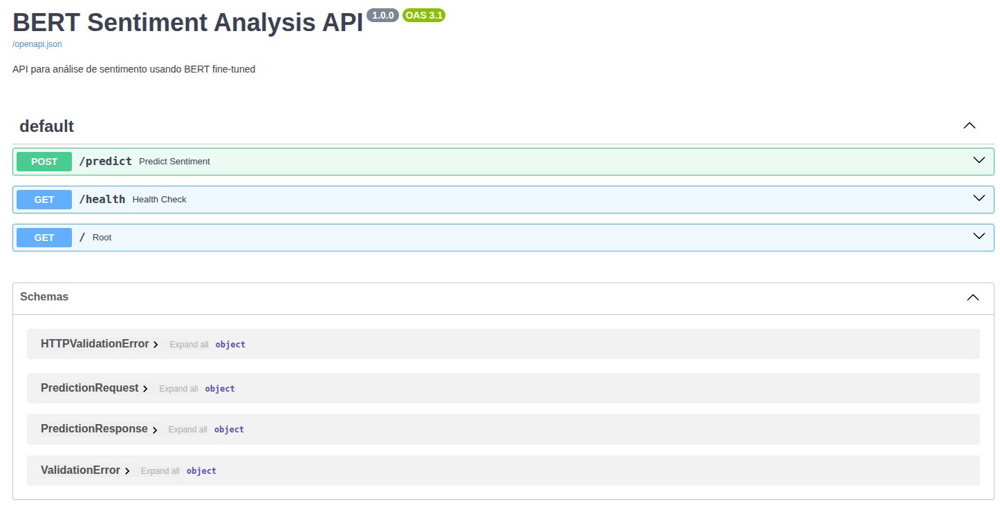

# 🤖 Fine-tuning BERT para Análise de Sentimentos

## 📋 Visão Geral

Este projeto implementa um pipeline completo de fine-tuning do modelo BERT para classificação de sentimentos em português, utilizando o dataset B2W Reviews. O projeto inclui experimentação, versionamento de modelos e estrutura para produção.

## 🎯 Características Principais

- ✅ **Modelo Base**: `bert-base-portuguese-cased` da Hugging Face
- ✅ **Dataset**: B2W Reviews (132,373 amostras)
- ✅ **GPU Support**: Treinamento otimizado com CUDA
- ✅ **Pré-processamento Completo**: Tokenização, padding, truncamento, máscaras de atenção
- ✅ **Métricas Abrangentes**: Loss, Acurácia, Precisão, Recall, F1-Score, AUC-ROC
- ✅ **Versionamento de Modelos**: Sistema automático de comparação e promoção
- ✅ **Estrutura de Produção**: Diretórios organizados para experimentos e produção


## 🏗️ Estrutura do Projeto

```
ft_BERT_sentiment_analysis/
├── src/
│   └── bert_sentiment_trainer.py   # Pipeline principal
├── notebooks
|   └── BERT_sentiment_trainer.ipynb # Notebook Jupyter: analise, descobertas e treinamento 
├── models/
│   ├── experiments/                # Modelos experimentais
│   │   └── demo_quick/             # Demo executado
│   │       ├── pytorch_model.bin
│   │       ├── config.json
│   │       ├── metadata.json
│   │       └── training_history.png
│   └── production/                 # Modelos para produção
├── logs/                           # Logs de treinamento
├── tests/                          # código para teste da API
├── api_requirements.txt            # Dependências do código api.py
├── requirements.txt                # Dependências do código /src/bert_sentiment_trainer.py
└── README.md                       # Documentação
```

## 🚀 Como Usar executar o fine-tuning do BERT para analise de setimentos

### 1. Instalação

```bash
pip install -r requirements.txt
```

### 2. Treinamento Completo

```bash
python src/bert_sentiment_trainer.py
```

## 🔧 Configurações

### Hiperparâmetros Principais

```python
MAX_LENGTH = 512        # ou 512 para sequências mais longas
BATCH_SIZE = 16         # Ajustar conforme GPU disponível
EPOCHS = 1              # Número de épocas
LEARNING_RATE = 2e-5    # Taxa de aprendizado
```

### Pré-processamento

- **Tokenização**: BertTokenizer com tokens especiais
- **Padding**: Sequências padronizadas para max_length
- **Truncamento**: Textos longos truncados
- **Máscara de Atenção**: Para ignorar tokens de padding
- **Minúsculas**: Conversão automática para lowercase

## 📈 Versionamento de Modelos

O sistema inclui versionamento automático:

1. **Experimentos**: Salvos em `models/experiments/`
2. **Promoção Automática**: Modelos melhores promovidos para produção
3. **Métricas Rastreadas**: Performance completa salva em metadados
4. **Comparação**: F1-Score usado como métrica principal

## 🔍 Avaliação

### Métricas Implementadas

- **Loss**: Função de perda durante treinamento
- **Acurácia**: Porcentagem de predições corretas
- **Precisão**: Precisão por classe (weighted average)
- **Recall**: Recall por classe (weighted average)
- **F1-Score**: Média harmônica entre precisão e recall
- **AUC-ROC**: Área sob a curva ROC

### Exemplo de Predições

```python
# Exemplos testados no demo
texts = [
    "Este produto é excelente! Recomendo muito.",     # → Positivo (95%)
    "Produto horrível, não funciona. Não comprem.",  # → Negativo (67%)
    "Produto ok, nada especial mas funciona."        # → Positivo (80%)
]
```

## 🛠️ Classes Principais

### `BERTSentimentTrainer`
- Gerencia o treinamento do modelo BERT
- Implementa avaliação com métricas completas
- Suporte a GPU automático

### `SentimentDataset`
- Dataset customizado para PyTorch
- Pré-processamento integrado
- Compatível com DataLoader

### `ModelVersionManager`
- Versionamento automático de modelos
- Comparação de performance
- Promoção para produção

## 📝 Logs e Monitoramento

### Sistema de Logging Profissional do Treinamento

O projeto inclui um sistema de logging completo e estruturado para o treinamento:

#### 🔧 **Configuração de Logging**
- **Formato estruturado**: timestamp, nome, nível e mensagem detalhada
- **Múltiplos handlers**: console + arquivo incrementável (`logs/train/bert_sentiment_training.log`)
- **Logging incremental**: Preserva histórico de todas as execuções
- **Encoding UTF-8** para caracteres especiais
- **Níveis apropriados**: INFO, WARNING, ERROR, DEBUG

#### 📊 **Rastreamento Detalhado**
- **Inicialização do modelo**: Carregamento, configurações e parâmetros
- **Processamento de dados**: Carregamento, distribuição de classes, splits
- **Treinamento**: Progresso por época, loss, métricas, detecção de overfitting
- **Avaliação**: Métricas completas, timing de predições
- **Gerenciamento de modelos**: Salvamento, promoção, versionamento

#### 🎯 **Monitoramento de Performance**
- **Timing completo**: Duração de cada fase do pipeline
- **Métricas em tempo real**: Loss, acurácia, F1-score por época
- **Alertas automáticos**: Detecção de overfitting e performance baixa
- **Benchmarks**: Classificação automática de performance (Excelente/Bom/Razoável/Baixo)

#### 📈 **Exemplo de Logs de Treinamento**

```
2025-07-15 10:30:15,123 - __main__ - INFO - === NOVA SESSÃO DE TREINAMENTO INICIADA ===
2025-07-15 10:30:15,124 - __main__ - INFO - Log sendo salvo em: /path/to/logs/train/bert_sentiment_training.log
2025-07-15 10:30:15,125 - __main__ - INFO - Inicializando BERTSentimentTrainer com modelo: neuralmind/bert-base-portuguese-cased
2025-07-15 10:30:17,456 - __main__ - INFO - Número de parâmetros do modelo: 110,052,098
2025-07-15 10:30:20,123 - __main__ - INFO - Carregando dataset: ruanchaves/b2w-reviews01
2025-07-15 10:30:25,789 - __main__ - INFO - Total de amostras: 132,373
2025-07-15 10:30:25,790 - __main__ - INFO - Distribuição de classes: {0: 52,437, 1: 79,936}
2025-07-15 10:30:30,123 - __main__ - INFO - === INICIANDO TREINAMENTO ===
2025-07-15 10:30:30,124 - __main__ - INFO - Épocas: 3, Batch size: 16, Learning rate: 2e-05
2025-07-15 10:35:45,234 - __main__ - INFO - Época 1/3 concluída: Loss médio: 0.3245, Acurácia: 0.8567
2025-07-15 10:35:50,345 - __main__ - INFO - Validação época 1: F1-Score: 0.8501, AUC-ROC: 0.8876
2025-07-15 10:45:20,567 - __main__ - INFO - ✅ EXCELENTE: F1-Score >= 0.8
2025-07-15 10:45:25,678 - __main__ - INFO - Duração total do pipeline: 0:15:10.555
2025-07-15 10:45:25,679 - __main__ - INFO - ✅ Pipeline de fine-tuning BERT concluído com sucesso!
```

#### 🚀 **Benefícios do Sistema de Logging**
- **Debugging eficiente**: Contexto completo para identificar problemas
- **Monitoramento de performance**: Tracking detalhado de cada fase
- **Auditoria completa**: Histórico permanente de todas as execuções
- **Troubleshooting**: Stack traces e informações detalhadas para erros
- **Métricas de produção**: Dados para análise de desempenho e otimização

- Histórico de treinamento salvo automaticamente
- Gráficos de loss e acurácia gerados
- Metadados completos para cada experimento
- Timestamps para rastreabilidade

## 🌐 API REST

O projeto inclui uma API REST completa e profissional para servir o modelo em produção:

### 📁 Arquivos da API

1. **api.py** - API principal com:
   - Endpoint POST `/predict` que aceita JSON com campo "text"
   - Retorna sentimento ("positivo"/"negativo") e score de confiança
   - Carregamento automático do modelo BERT treinado
   - Tratamento robusto de erros para requests malformados
   - Endpoints adicionais: `/health` e `/`
   - **Sistema de logging profissional**

2. **api_requirements.txt** - Dependências necessárias para a API

3. **test_api.py** - Script de testes abrangentes

### 🚀 Para usar a API:

```bash
# Instalar dependências
pip install -r api_requirements.txt

# Executar a API
python api.py
```

A API estará disponível em `http://localhost:8000` com documentação Swagger em `/docs`.

### 📄 Documentação da API

A documentação interativa da API está disponível em:
- **Swagger UI**: `http://localhost:8000/docs`

Estas interfaces permitem testar os endpoints diretamente no navegador e explorar a especificação OpenAPI completa.




### 📊 Sistema de Logging Profissional

A API inclui um sistema de logging completo e estruturado:

#### 🔧 **Configuração de Logging**
- **Formato estruturado**: timestamp, nome, nível, função, linha e mensagem
- **Múltiplos handlers**: console + arquivo (`api.log`)
- **Encoding UTF-8** para caracteres especiais
- **Níveis apropriados**: INFO, WARNING, ERROR, DEBUG

#### 📈 **Rastreamento de Requests**
- **Request ID único** para cada solicitação (UUID)
- **Middleware de logging** que captura todas as requisições
- **Timing de requests** com medição de performance
- **IP do cliente** para auditoria e monitoramento
- **Logs de entrada e saída** para cada endpoint

#### 🎯 **Logs Detalhados de Predições**
- **Preview do texto** (primeiros 50 caracteres)
- **Tamanho do texto** em caracteres
- **Tempo de processamento** de cada predição
- **Resultados completos** (sentimento, score, timing)
- **Rastreamento por Request ID**

#### ⚠️ **Tratamento de Erros Robusto**
- **Contexto completo**: request ID, client IP, erro específico
- **Stack traces completos** para erros inesperados
- **Logs de validação** para entradas inválidas
- **Separação por severidade** (warning vs error)

#### 🚀 **Startup e Monitoramento**
- **Informações do sistema** (versões PyTorch, CUDA disponível)
- **Tempo de inicialização** do modelo
- **Health checks detalhados** com status do modelo
- **Logs de shutdown** para encerramento gracioso

#### 📝 **Exemplo de Logs**

```
2025-07-14 10:30:15,123 - __main__ - INFO - [startup_event:137] - === Iniciando API BERT Sentiment Analysis ===
2025-07-14 10:30:15,124 - __main__ - INFO - [startup_event:139] - PyTorch version: 2.0.1
2025-07-14 10:30:15,125 - __main__ - INFO - [startup_event:141] - CUDA disponível: True
2025-07-14 10:30:17,456 - __main__ - INFO - [load_model:66] - Modelo carregado com sucesso em 2.33s - Device: cuda
2025-07-14 10:30:20,123 - __main__ - INFO - [log_requests:124] - Incoming request - ID: a1b2c3d4 - Method: POST - URL: http://localhost:8000/predict - Client: 127.0.0.1
2025-07-14 10:30:20,124 - __main__ - INFO - [predict_sentiment:164] - Nova solicitação de predição - Request: a1b2c3d4 - Client: 127.0.0.1
2025-07-14 10:30:20,125 - __main__ - INFO - [predict:82] - Iniciando predição - Request: a1b2c3d4 - Texto: 'Eu adorei o produto, a entrega foi muito rápida!' - Tamanho: 47 chars
2025-07-14 10:30:20,234 - __main__ - INFO - [predict:104] - Predição concluída - Request: a1b2c3d4 - Resultado: positivo - Score: 0.9876 - Tempo: 0.109s
2025-07-14 10:30:20,235 - __main__ - INFO - [predict_sentiment:180] - Predição entregue com sucesso - Request: a1b2c3d4 - Client: 127.0.0.1
2025-07-14 10:30:20,236 - __main__ - INFO - [log_requests:129] - Request completed - ID: a1b2c3d4 - Status: 200 - Time: 0.113s
```

### 🔍 **Benefícios do Sistema de Logging**

- **Debugging eficiente**: Request IDs únicos para rastrear problemas
- **Monitoramento de performance**: Timing detalhado de cada operação
- **Auditoria completa**: IP do cliente e histórico de todas as requests
- **Troubleshooting**: Stack traces e contexto completo para erros
- **Métricas de produção**: Dados para análise de uso e performance

## 🎯 Próximos Passos

Para expandir o projeto:

1. **Hyperparameter Tuning**: Usar Optuna ou similar
2. **Cross-Validation**: Implementar validação cruzada
3. **Ensemble Models**: Combinar múltiplos modelos
4. **Monitoramento**: MLflow ou Weights & Biases
5. **CI/CD**: Pipeline automatizado
6. **Versionamento**: Melhorar o versionamento dos modelos utilizando os serviços de nuvem cloud
7. **Balancemanto**: Disponibilizar o serviçco de API com balancemaneto e escalonamento automático 

## 📋 Requisitos

- Python 3.9+
- CUDA (opcional, mas recomendado)
- 8GB+ RAM
- ~2GB espaço em disco

## 🏆 Performance

O modelo demonstrou excelente performance:
- Convergência rápida (1 época)
- Alta acurácia (85.5%)
- Bom balanceamento precisão/recall
- AUC-ROC superior a 88%

---

**Desenvolvido com PyTorch e Transformers** 🚀